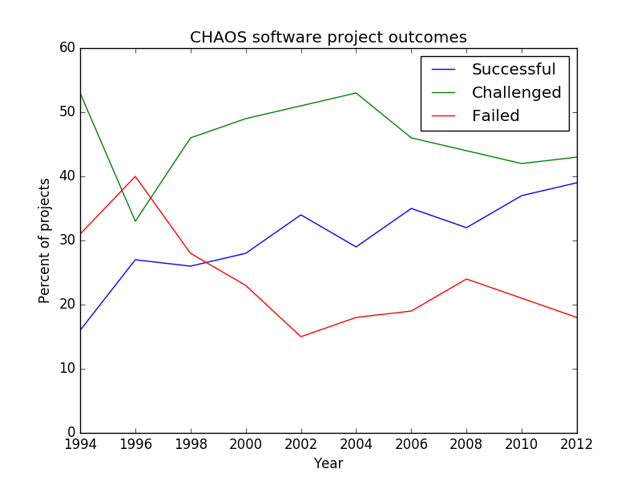
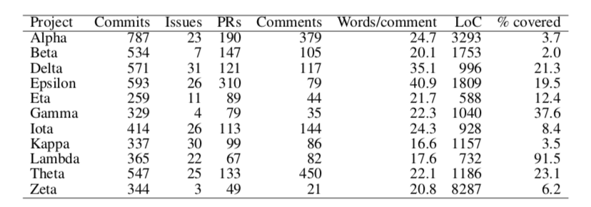

---
# YAML metadata
title: How should we teach brain imaging?
author: Matthew Brett
date: "September 19 2024"
bibliography: "reproduce.bib"
<#ifndef HANDOUT>
suppress-bibliography: true
<#endif>
---

# Inheritance

[Let them eat Gauss](http://asterisk.dynevor.org/courses-on-imaging-often.html)

# The problem

$$
y = \mathbf{X} \vec{\beta} + \vec{\epsilon}
$$

# Some barriers

* Unfamiliarity with ideas and tools.
* ["Makes sense" epistemology](http://asterisk.dynevor.org/makes-sense.html).
* "Garbage in, gospel out".
* Black or transparent box software and pipelines.

# Opening the black box

> The tools we use have a profound (and devious!) influence on our thinking
> habits, and, therefore, on our thinking abilities."

Edsger W. Dijkstra [How do we tell truths that might
hurt?](http://www.cs.virginia.edu/~evans/cs655/readings/ewd498.html)

# Opening the black box

[What I cannot create, I do not
understand](http://archives-dc.library.caltech.edu/islandora/object/ct1%3A551)

Found on Richard Feynman's blackboard after his death.

# The programme

* Code first.
* Working process.

# Code first

* [PrinciplesStatistics](http://imaging.mrc-cbu.cam.ac.uk/imaging/PrinciplesStatistics)
* [The script](http://imaging.mrc-cbu.cam.ac.uk/scripts/statstalk.m)

# Examples

* [What is an image?](https://matthew-brett.github.io/fbi2018/chapters/02/arrays_and_images);
  <http://bit.ly/what_is_an_image>
* [Optimizing space](https://matthew-brett.github.io/fbi2018/chapters/03/optimizing_space);
  <http://bit.ly/optimizing_space>

# But - this is too much

* Understand what algorithms are, how they are implemented as programs on
  digital devices, and that programs execute by following precise and
  unambiguous instructions;
* Create and debug simple programs;
* Use logical reasoning to predict the behaviour of simple programs
* Use technology purposefully to create, organise, store, manipulate and
  retrieve digital content

# Coding is not a specialist skill

* Understand what algorithms are, how they are implemented as programs on
  digital devices, and that programs execute by following precise and
  unambiguous instructions;
* Create and debug simple programs;
* Use logical reasoning to predict the behaviour of simple programs
* Use technology purposefully to create, organise, store, manipulate and
  retrieve digital content

[National curriculum in
computing](https://www.gov.uk/government/publications/national-curriculum-in-england-computing-programmes-of-study/national-curriculum-in-england-computing-programmes-of-study):
Key stage 1 (5-7 year olds).

# Undergraduate data science in Berkeley

* [Foundations of data science](http://data8.org).
* Running since 2015.
* First / second year optional course
* ~1500 students
* All majors.
* No requirements in mathematics or programming.
* [Interactive online textbook](https://www.inferentialthinking.com).

# Principles of foundations course

* Teaching statistics "assuming computers exist, rather than assuming they
  don't exist."
* "Express in code what we would otherwise express in equations."

John DeNero, [2018
Webinar](https://www.youtube.com/watch?v=5KCNaA2MfoU&feature=youtu.be)

# Working process in imaging

To various degrees:

* GUIs
* Ad-hoc data archiving and directory structure
* Poor transfer of metadata
* "Wisdom of the ancients" analysis scripts using various batch mechanisms.
* "Makes sense" epistemology for the statistics.
* Tests rare and optional.
* Stream of consciousness exploration.

# Is process important?

Two fields where conscious intervention was effective in increasing output
quality:

* car manufacture.
* software projects;

Note emphasis on:

* engagement;
* process.

# Toyota and General Motors

@helper2014management

# Toyota and General Motors

@helper2014management

# Culture at General Motors

> General Motors was a kind of throw it over the wall organization. Each
> department, we were very compartmentalized, and you design that vehicle, and
> you'd throw it over the wall to the manufacturing guys.

Ernie Schaefer, GM manager, interviewed in "NUMMI"; [This American Life
episode
403](https://www.thisamericanlife.org/radio-archives/episode/403/transcript)
(2010).

# Culture at Toyota

14 principles in four sections:

1. Long-term Philosophy;
2. The Right Process Will Produce the Right Results;
3. Add Value to the Organization by Developing Your People;
4. Continuously Solving Root Problems Drives Organizational Learning

[The Toyota Way](https://en.wikipedia.org/wiki/The_Toyota_Way)

# The Toyota Way - process

2. The Right Process Will Produce the Right Results;
    5. Build a culture of stopping to fix problems, to get quality right the
       first time.  Quality takes precedence (Jidoka).
    6. Standardized tasks and processes are the foundation for continuous
       improvement and employee empowerment.
    7. Use visual control so no problems are hidden.

# Software quality

{height=80%}

From the [Standish](https://www.standishgroup.com) CHAOS report 1994-2012.

# Code as personal property

> In the early years of programming, a program was regarded as the private
> property of the programmer. One would no more think of reading a colleague's
> program unbidden than of picking up a love letter and reading it. This is
> essentially what a program was, a love letter from the programmer to the
> hardware, full of the intimate details known only to partners in an affair.
> Consequently, programs became larded with the pet names and verbal shorthand
> so popular with lovers who live in the blissful abstraction that assumes
> that theirs is the only existence in the universe. Such programs are
> unintelligible to those outside the partnership.

Attributed to Michael Marcotty, quoted in [@mcconnell2004code, p 842]

# Developer responsibility

> .. in my office is a big poster that says "Nothing at Facebook is someone
> else's problem", and the remarkable thing about Facebook as an engineering
> organization is the degree to which 7000 people all actually agree on that
> ... the transition back in the dark ages wasn't from a healthy relationship
> [with quality assurance teams], it was from this very dysfunctional,
> aresponsibile attitude, throw it over the wall, long long cycles, vague
> feedback.  Going from that, to programmers accepting responsibility for the
> quality of their work, that was a huge step forward.

Kent Beck (2014) [discussing test-first
development](http://martinfowler.com/articles/is-tdd-dead).

# Modern process is more effective

              Agile   Waterfall
------------ ------- -----------
Successful    42%     14%
Challenged    49%     57%
Failed         9%     29%

Standish group (2011) "CHAOS report",
[summary](https://www.mountaingoatsoftware.com/blog/agile-succeeds-three-times-more-often-than-waterfall)

# Improving process

> In studies for which findings could be reproduced, authors had paid close
> attention to controls, reagents, investigator bias and describing the
> complete data set. For results that could not be reproduced, however, data
> were not routinely analysed by investigators blinded to the experimental
> versus control groups. Investigators frequently presented the results of one
> experiment, such as a single Western-blot analysis. They sometimes said they
> presented specific experiments that supported their underlying hypothesis,
> but that were not reflective of the entire data set.

@begley2012drug

# Process and code

The trained programmer:

* is more efficient;
* makes fewer mistakes;
* has a accurate and high estimate of the probability of mistakes;
* continues to learn.

[Teach yourself programming in ten years](https://www.norvig.com/21-days.html)

# Process etc curriculum

* version control;
* automation;
* testing;
* documentation;
* code re-use;
* code review.

@wilson2014best

# Can it be done?

"Reproducible and Collaborative Statistical Data Science", UC Berkeley, fall
2015.

* @millman2018rcsds
* [Main course page](http://www.jarrodmillman.com/stat159-fall2015)

# Our students

* Statistics undergraduates / masters students
* Various other disciplines, including neuroscience, architecture.
* Some background in probability, statistics, basic R programming.
* About two of 40 students had experience of FMRI analysis.

# What we covered

* Unix shell
* Version control
* Coding in Python
* Testing and continuous integration
* Images and arrays
* Basic statistical analysis of FMRI data.
* Group project replicating and / or extending OpenFMRI data analysis.

# How we did it

* Lecture, exercise, reinforce, add new element, repeat.
* Using code to explain the ideas.
* Heavy emphasis on project, with multiple review points.
* All group projects public.
* All project work using public Git and Github mechanisms
* No FMRI analysis packages allowed.
* We used no Jupyter Notebooks.

# How well did it work?

> [U]nlike most group projects (which last for maybe a few weeks tops or could
> conceivably be pulled off by one very dedicated person), this one will
> dominate the entire semester. . . . Try to stay organized for the project
> and create lots of little goals and checkpoints. You should always be
> working on something for the project, whether that's coding, reviewing,
> writing, etc. Ask lots of questions and ask them early!

# Projects

All at https://github.com/berkeley-stat159/

# A simple replication / exploration

https://github.com/berkeley-stat159/project-epsilon

* dataset ds000005---the "Mixed-gambles task"
* outlier detection (from class)
* logistic regression models of behavioral data.
* image smmoothing (Scipy)
* FMRI drift models, including PCA
* GLM at each voxel
* Bonferroni correction

# Extension

https://github.com/berkeley-stat159/project-lambda

* ds000113---a high-resolution FMRI dataset of Forrest Gump;
* Very large images
* Cross voxel time course correlations
* Found image artefacts, error in original paper
* Replicated image correlations
* Extended to Random Forest Model to predict indoor, outdoor.

> We strongly encourage running on a machine with 120 GBs of accessible RAM to
> emulate development environment.

# Git / github

@millman2018rcsds

# How we followed up

<https://bic-berkeley.github.io/psych-214-fall-2016/syllabus.html>

# And now?

1. Code first.
2. Teach principles through code.
3. Then teach working practice.
4. Build on this foundation.

# The end

Thanks to:

* Jarrod Millman.
* JB Poline.
* Stefan van der Walt.
* Paul Ivanov.
* All the Nipy developers.

All material for this talk at
<https://github.com/matthew-brett/how-teach-imaging>.

<#ifdef HANDOUT>
# References
<#endif>
